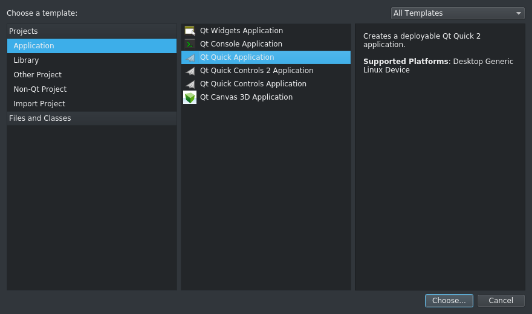
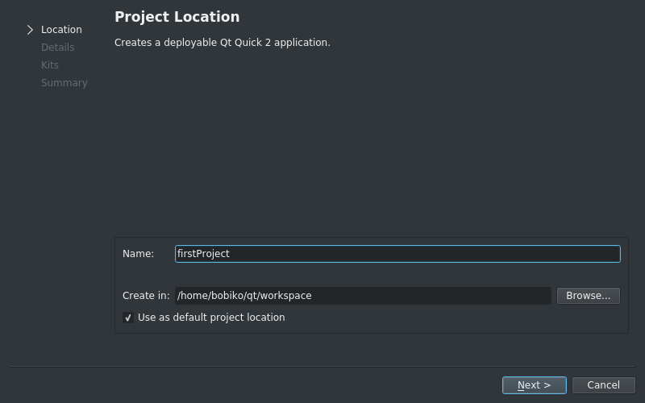
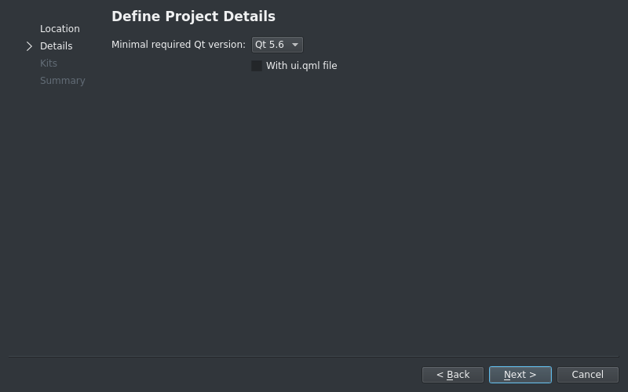
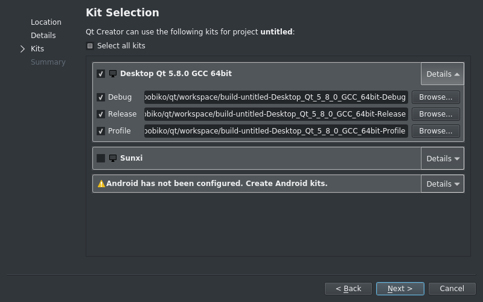

First project in Qt Creator
============================

Before we start with learning Qt we should first learn how to create and \
maintain the project in Qt creator:

1. Open Qt Creator, go to the Welcome page, \
and click Projects -> New Project

|

2. Since we want to check if everything is working fine, we pick \
Qt Quick Application and click next

|
|

3. Give a name and place for a project. It is always a nice idea to store all \
projects in one place, so you can create a workspace and mark it as a default \
project location.

|
|

4. Pick a minimal version of Qt libraries. Since we don't really care about \
compatability so far, you can leave it as it is. But we also won't use \
Qt Designer this time, so unmark "With ui.qml file".

|
|

5. Pick a kit to use. Most probably you will only have one kit, thus you have \
not so many options. But interesting part is hidden in details. Here you can \
define a place and a name for a building directory. By default it is located \
on the same level as the project folder, but you can choose any other level \
or  a foldr name, it should not bring you any troubles except a warning. You \
can also see that there three possible versions: debug, release, and progile. \
You can freely use any of them, the differnce is only that debugging and \
profiling versions add some information to executable for debugging/profiling.

|
|

6. Finish the creation

After finishing the creation Creator will open the project and show main.qml \
file.

On the left side you can see the structure of a project. It include .pro file, \
you won't usually change, it is just specifies Qt modules used in the project \
and sources and headers. Then the project has sources and headers sections. Since \
we don't have any headers in our project, so you shall only be able to see the \
Sources section. Next, there is a resource section. We will later talk about \
what resources are, but long story \
short those are collections of files that will be included into executable, so \
later on you will only need to put one file in the target machine for \
deployment instead of bunch of pictures and conf files.

You can see that main.qml represents some basic "hello world"-like template. \
Let's change it now for something just a bit fancier to get to know how to add files \
to a project. Let it be clocks, for example.

First update the main.cpp and main.qml files. Replace the contents of\
main.qml with following lines:

.. include:: ../../src/firstproject/main.qml
  :code: qml

|

QML may now look a bit weird, but later yu will see that it is very useful when
implementing GUI. Next, open main.cpp file and replace its contents with next lines:

.. include:: ../../src/firstproject/main.cpp
  :code: c

|

No we need to add to the project images that we are going to use in the project.
You can download pics from \
`github qtlabs repo <https://github.com/polyakovkrylo/qtlabs>`_  in \
src/firstproject/pics. Create a new directory called pics inside the project \
and put the downloaded pics into that folder. Now you need to add them to a \
project resources. To add new files to resources right click on Resources \
section -> Add existing... and choose all pics you need (hold Ctrl or Shift for \
multi-picking). Adding sources is similiar to adding resources, you only need to
right click on sources or headers and add new or existing files.

From now on you should be able to run your first app. Click Run in the \
bottom corner. Your application shall run as a bottom window, so hide other windows \
to check it out. Our application has frameless window, so in order to close it \
just click Stop button in Qt creator above Application output section.
Congratulations! You have just finised your first app. Try now just to tune it a bit:

1. Clock arrows move to slow. Try to find a way to make the minute arrow act like a \
second arrow and the hour arrow act like a minute arrow

.. hint::
  Search main.qml for the answer

2. Why should our app run on the bottom? Let's move it to foreground!

.. hint::
  You should probably delete something in main.cpp
