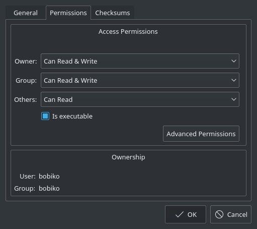
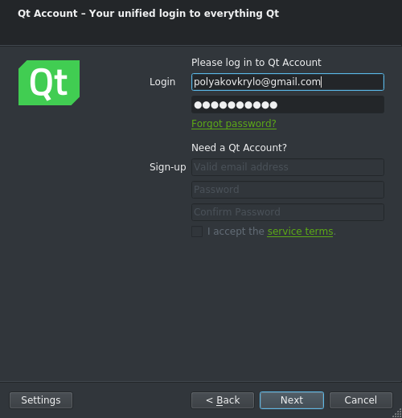
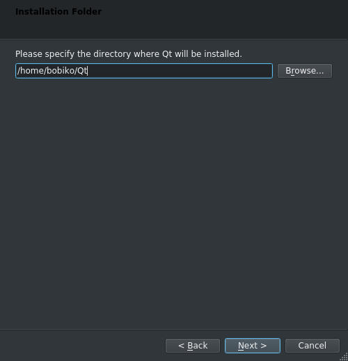
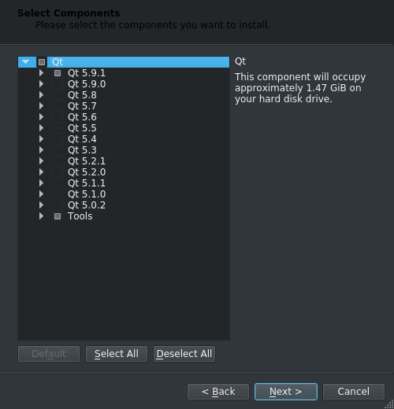
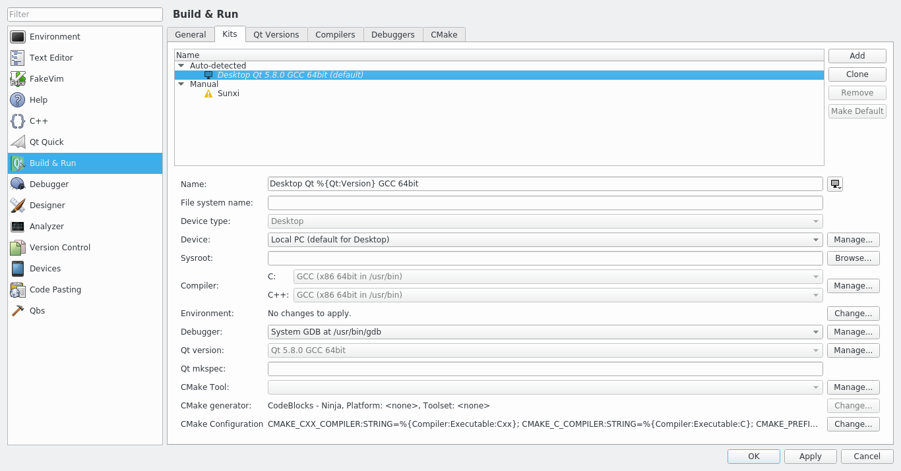
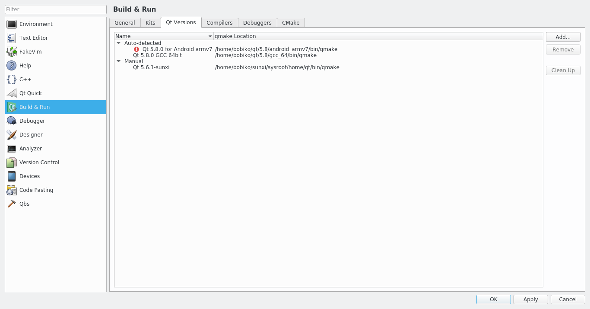
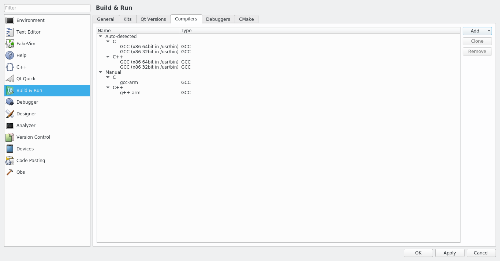

Qt installation
================

Let's first start with installation of Qt and proceed with trying it out by
creating a simple hello world project:

.. note::
  Installation will use approx. 1.47GiB of disk space.

1. Go to `Qt download page <https://info.qt.io/download-qt-for-application-development>`_\
and download Qt by picking open source version.

|

2. After downloading installer run it. Linux users need to add permission for \
execution. For that, right click on file -> Properties -> set flag on \
'is executable', than it should become executable.

|
|

3. You can skip creating a Qt account or, obviously, create one.

|
|

4. Choose the path you would like to install Qt

|
|

5. On selecting components page pick the latest version of Qt \
(5.9.1 at the moment) and Tools.

|
|

6. Install it!

If everything went good, you shall be able to start Qt Creator. Now, let's  set up \
the build configuration.

-----------------------------------
Setting up the build configuration
-----------------------------------

Before you can start using Qt you need to ensure that the build configuration is\
set properly. Long story short, configuration includes selection of a compiler\
and a version Qt libraries. A combination of these two components (compiler \
and Qt version) is called a kit and is a corner stone of cross-compilation. But\
we will get back to it later. Now you ony need to check if the default kit is\
working fine. To do that:

1. Start Qt \
creator.

|

2. Go to Tools -> \
Options...

|

3. Select Build & Run in the menu on the left, then pick tab Kits, and check if\
there is an Auto-detected kit. If there is one, select it and check if both C \
and C++ compilers are set. If both are set, it means that your kit is properly \
set and you can skip the rest of this part and start with your \
`first project <firstproject.html>`_.

|
|

4. If no kit is auto-detected or if auto-dected misses Qt version or compilers,\
you have to set them up manually.

|

5. To set up Qt version go to Qt versions tab -> Add... ,go to the \
Qt installation path and search for qmake file inside that folder. It should \
somewhere inside folder like  5.9/gcc_64/bin depending on the platform and \
version used.

|
|

6. To set up compilers go to Compilers tab -> Add, select the proper compiler \
that you use (usually MinGW for Windows and GCC for Linux) and search for gcc \
and g++ in the system.

|
|

After just click ok and that is it! You are ready for your first project!
